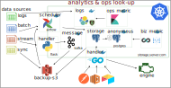
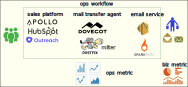

---
title:
- Data pipe proposal
author:
- Giovanni Marelli
theme:
- black
date:
- 2022/09/19
header-includes:
- '<link rel="stylesheet" href="css/slide_custom.css">'
output: 
  revealjs::revealjs_presentation: 
    css:
      - "css/style.css"
      - "fonts/fonts.css"
---

# principles for a data pipeline

- **modular**: each component should be maintained and developed independently
- **monitored**: we know what breaks and why
- **historical consistency**: ability to perform consistent analytics on past data
- **quality assurance**: we know when a KPI deteriorates and which days to exclude from analytics
- **alerts**: we get promptly informed when something goes wrong
- **control panel**: on the jobs running, ability to re-run and re-schedule
- **analytics platform**: parse and display the relevant metrics
- **privacy layer**: compliance and safe analytics 

# where do we stand?

- **code**: monolithic like code, no object oriented, one main contributor left, documentation missing
- **ops**: we have few dockers, no orchestration
- **repo**: the repository contains operations, monitoring, storage management, reporting... few libraries
- **storage**: we have a postgres, sqlite files, tool's own database (sent emails)
- **data amount**: we are still not handling big data, good chance for redundancy 

# existing data sources

Documented [in notion](https://www.notion.so/lightmeter/Internal-production-data-9f7f1c400c2c499092f67c50dafe2824)

- **postgres**: email traffic and some metrics
- **SQLite**: 
  * _bounces_ bounced email addresses
  * _l3m_ table to populate the main UI
  * _logtracker_ populates the control center
- **sent emails**: roundcube email server
- **CRM**: pipedrive to connect
- **spreadsheets**: different business critical spreadsheets not connected

# requirements

- **integrate external platforms**: easy way to include external platforms in the loop
- **warming metrics**: store and display warming metrics per client
- **operational monitoring**: logtrace to extend
- **delivery funnel**: complains and spam are missing
- **spreadsheets**: link the existing spreadsheets to databases -> airtable
- **centralized db**: store most of the information in a central place
- **visualization**: internal (external?) dashboard
- **l3m**: migration of the UI

# design

{width=1200px}

# operation workflow/funnel

{width=1200px}

# preliminaries

- **data modeling**: how do we structure the data considering futuristic changes, what should stay relational
- **metadata**: cluster information 
- **naming convention**: I would avoid `rcpt` as `recipient`, `topmx`... which we struggle to understand. 
- **entity relationship management**: which IDs will connect all the tables, what we identify as unity (clients, campaigns, platform, transport...)
- **access control list**: which access group should we create and what permissions do we need to grant (security, stability, traceability)
- **operational metrics**: what are the fundamental metrics to consider
- **business metrics**: what are the business goals to monitor

# roadmap

- **cluster**: build the cluster, prepare the containers and link them
- **central db**: set up a central db (digital ocean?) and create an API
- **platform integration**: ad-hoc ETL, lambda, postman
- **replace routines**: decouple from the monolith to single services
- **refining requirements**: metrics, data structure, touchpoints
- **API building**: document with swagger
